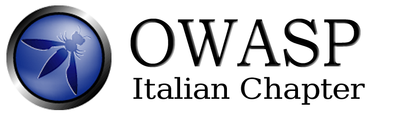

---

layout: col-sidebar
title: OWASP Italy
tags: home, Italy
level: 0
meetup-group: owasp-italy-meetup-group
site_side: true
region: Europe

---

# Welcome to the OWASP Italy Chapter!

We aim to organize the next activities of the chapter:
* One annual conference;
* Periodic meetings and workshops. 

How can you help?
* If you would like to host a meeting or speak in one, contact [the leaders](mailto:owasp-italy@owasp.org)
* Spread the word: Reaching out for more people, especially outside of the AppSec community.

## Participation
The Open Web Application Security Project (OWASP) is a nonprofit foundation that works to improve the security of software. All of our projects ,tools, documents, forums, and chapters are free and open to anyone interested in improving application security. 

Chapters are led by local leaders in accordance with the [Chapter Leader Handbook](/www-policy/rules-of-procedure/chapter-handbook). Financial contributions should only be made online using the authorized online donation button. To be a SPEAKER at ANY OWASP Chapter in the world simply review the [speaker agreement](/www-policy/speaker-agreement) and then contact the local chapter leader with details of what OWASP Project, independent research, or related software security topic you would like to present.

Everyone is welcome and encouraged to participate in our [Projects](/projects), [Local Chapters](/chapters), [Events](/events), [Online Groups](https://groups.google.com/a/owasp.com/){:target='_blank'}, and [Community Slack Channel](https://owasp.slack.com/){:target='_blank'}. We especially encourage diversity in all our initiatives. OWASP is a fantastic place to learn about application security, to network, and even to build your reputation as an expert. We also encourage you to be [become a member](/membership) or consider a [donation](/donate) to support our ongoing work.

## 2021 Local News
- The slides of the OWASP Italy Day 2021 talk will be online soon [here].(/www-chapter-italy/events/owasp-day-210428)!
- We are planning other 2 meetup meetings, stay tuned!
- Everyone is welcome to join us at our chapter meetings.

## Future Events

### Upcoming Meetings

We schedule our meetings on the [OWASP Italy Meetup Group](https://www.meetup.com/owasp-italy-meetup-group/)



Our meetings are open to the public, and you do not need to be a member to attend. Please do consider [joining OWASP](https://owasp.org/membership/) if you find our community, projects, and meetings valuable, or sponsoring this chapter.

## Past Events

### OWASP-Italy Day - 28th April 2021
The program of the event is available [here](https://owasp.org/www-chapter-italy/events/owasp-day-210428)

### OWASP-Italy MeetUp - 26th February 2021
14:00 OWASP News and Introduction - Matteo Meucci, Stefano Calzavara
14.30 - 17: Heap exploitation and CTF - f00kies@unive

Please see it for details:
https://www.meetup.com/owasp-italy-meetup-group/

